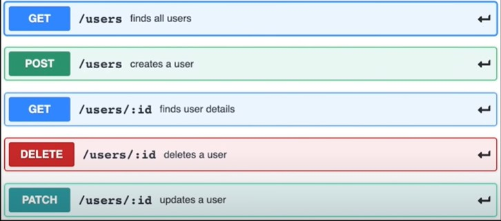

# REST_API_PROJECT8

Technologies used:

1) Node JS
2) Express JS
3) Postman

  

<h2>This is a custom built REST API,which provides options like:<h2>

. Get information of all the users in the database 
. Add new users in the database.
. Delete users from the database.
. Get a user by his/her unique Id.
. Modify the user's information.
